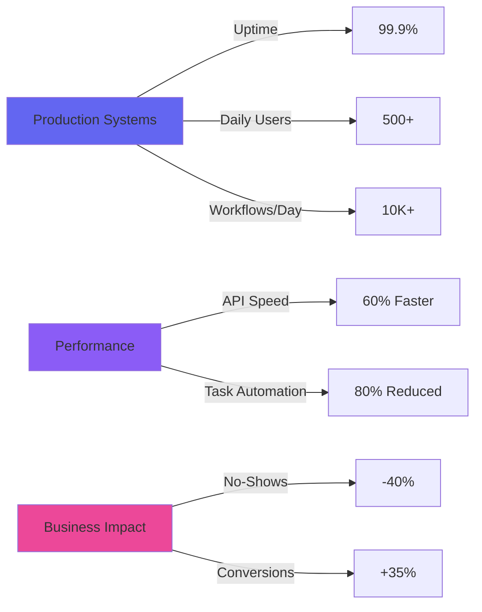

<div align="center">

# 👋 Hi, I'm Arthur Bezerra

### Full Stack Developer | AI Automation Specialist | Healthcare Tech

<p align="center">
  <a href="mailto:arthurbezerra.dev@gmail.com">
    
  </a>
  <a href="https://bezerradev.com">
    
  </a>
  <a href="https://linkedin.com/in/arthur-n8n-dev">
    
  </a>
  <a href="https://github.com/artubss">
    
  </a>
  <a href="https://wa.me/5584994198787">
    
  </a>
</p>


</div>

---

## 🚀 About Me

```typescript
const arthur = {
  location: "Brazil 🇧🇷 (Remote)",
  timezone: "UTC-3",
  languages: ["Portuguese", "English", "Spanish", "German"],
  
  specialization: {
    focus: "AI-Powered Automation Ecosystems",
    industries: ["Healthcare", "E-commerce", "SaaS"],
    impact: {
      dailyUsers: "500+",
      uptime: "99.9%",
      workflowsPerDay: "10K+"
    }
  },
  
  currentlyBuilding: [
    "🏥 Healthcare automation systems",
    "🤖 LangChain/LangGraph AI agents",
    "⚡ High-performance microservices",
    "🛒 E-commerce platforms"
  ],
  
  openTo: ["Full Stack Roles", "AI Integration", "Remote Opportunities"]
};
```

<div align="center">

### 💡 What I Deliver

| 🎯 Achievement | 📊 Metric |
|:---------------|:----------|
| **User Base** | 500+ daily active users |
| **System Uptime** | 99.9% reliability |
| **API Performance** | 60% faster response times |
| **No-Show Reduction** | 40% improvement |
| **Conversion Increase** | 35% boost |
| **Task Automation** | 80% routine work eliminated |
| **Workflow Processing** | 10K+ workflows/day |

</div>

---

## 🎨 Featured Projects

<table>
<tr>
<td width="50%">

### 🛒 WhatsApp E-commerce Platform
[](https://nossocloset.com)

**Complete e-commerce system with AI customer service**

**Tech Stack:**
- Next.js • Node.js • FastAPI
- Gemini AI • Supabase • Stripe
- Redis • WebSockets • Jenkins

**Key Features:**
- ✅ JWT auth with RBAC
- ✅ Automated invoice generation
- ✅ Real-time order tracking
- ✅ AI-powered support
- ✅ Payment processing

**📈 Results:**
```diff
+ 35% conversion increase
+ 50% support workload reduction
+ High-volume daily transactions
```

</td>
<td width="50%">

### 🏥 Medical Clinic Automation
[](https://github.com/artubss)

**24/7 automation serving 500+ patients daily**

**Tech Stack:**
- n8n • Python • Django • FastAPI
- OpenAI • RabbitMQ • Supabase
- WhatsApp API • Redis

**Key Features:**
- ✅ AI-powered patient triage
- ✅ Automated scheduling
- ✅ EHR system integration
- ✅ Real-time dashboard
- ✅ LGPD/HIPAA compliance

**📈 Results:**
```diff
+ 40% no-show reduction
+ 80% tasks automated
+ 99.9% uptime maintained
```

</td>
</tr>

<tr>
<td colspan="2">

### ⚙️ Multi-Tenant Automation Platform (SaaS)
[](https://github.com/artubss)

**Enterprise SaaS for custom workflow automation**

**Tech Stack:** n8n • Node.js • PostgreSQL • RabbitMQ • Vue.js • Docker • Kubernetes • Jenkins

**Key Features:**
- ✅ Multi-tenant architecture with data isolation
- ✅ Custom n8n nodes + API Gateway
- ✅ Real-time monitoring (Prometheus + Grafana)
- ✅ Scalable microservices infrastructure

**📈 Results:**
```diff
+ 50+ active clients
+ 10K+ workflows processed daily
+ Enterprise-grade reliability
```

</td>
</tr>
</table>

---

## 🛠️ Tech Stack

<div align="center">

### **Backend & Automation**


### **AI & Machine Learning**


### **Frontend**


### **Database & Caching**


### **DevOps & Infrastructure**


### **Message Queues & Real-time**


</div>

---

## 📊 GitHub Stats

<div align="center">
  
  
</div>

<div align="center">
  
</div>

---

## 💼 Professional Experience

<details open>
<summary><b>🏢 Full Stack Developer | Automation Engineer - Vicentimmed</b></summary>
<br>

**Mar 2025 - Present**

- 🔧 Architected n8n automation workflows with **99.9% uptime**
- 🤖 Integrated AI APIs (Gemini, OpenAI, Claude) with **RAG systems**
- ⚡ Built full-stack apps with **Next.js, React, Vue.js, Node.js**
- 📊 Optimized PostgreSQL databases reducing query time by **60%**
- 🚀 Implemented **CI/CD pipelines** with Jenkins and GitHub Actions
- 🔗 Developed **WhatsApp integrations** with event-driven architecture

</details>

<details>
<summary><b>🏢 Automation Developer | Full Stack Engineer - Cachina</b></summary>
<br>

**Jan 2025 - Feb 2025**

- ⚙️ Created n8n workflows saving **40 hours/month** of manual work
- 🐍 Developed custom automation systems with **Python/Django/FastAPI**
- 📨 Built message queue systems with **RabbitMQ and BullMQ**
- 🔄 Configured **CI/CD pipelines** with Jenkins

</details>

---

## 🎯 Key Achievements

<div align="center">



</div>

---

## 🌍 Languages & Availability

<div align="center">

| Language | Level |
|:---------|:------|
| 🇧🇷 Portuguese | Native |
| 🇺🇸 English | Fluent |
| 🇪🇸 Spanish | Fluent |
| 🇩🇪 German | Intermediate |

**📍 Location:** Brazil (Remote)  
**🕐 Timezone:** UTC-3  
**💼 Status:** Open to opportunities

</div>

---

## 📫 Let's Connect!

<div align="center">

### I'm open to opportunities in **Full Stack Development**, **AI Automation**, and **Healthcare Tech**

<p align="center">
  <a href="mailto:arthurbezerra.dev@gmail.com">
    
  </a>
  <a href="https://bezerradev.com">
    
  </a>
  <a href="https://linkedin.com/in/arthur-n8n-dev">
    
  </a>
  <a href="https://wa.me/5584994198787">
    
  </a>
</p>

---

### ⭐ If you find my projects interesting, consider starring them!


</div>

---

<div align="center">

**💻 Built with passion | 🚀 Deployed with precision | 🤖 Powered by AI**


</div>
